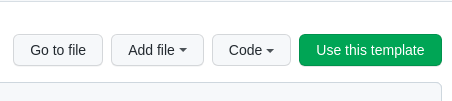

# MySQL-ERN Template (Dockerized)

[](./LICENSE) [](./CONTRIBUTING.md)

Instantly create MySQL-ERN based projects with this template.

## Get Started

### Step 1: Use This Template

Click **Use this template** button from the top-right corner to instantly create a new repo.



**Or,**

Use `gh` to create a new repository from this template.

```sh
gh repo create my-app -p ranajahanzaib/mysql-express-react-template
```

**Or**,

Clone this repository like:

#### SSH users

```sh
git clone git@github.com:ranajahanzaib/mysql-express-react-template.git
```

#### HTTPS users

```sh
git clone https://github.com/ranajahanzaib/mysql-express-react-template.git
```

#### gh-cli users

```sh
gh repo clone ranajahanzaib/mysql-express-react-template
```

### Step 2: Install Dependencies

Make sure you're inside the root of repository to install required dependencies.

```sh
npm install
```

### Step 3: Run

Use `npm start` command to run `docker-compose` services.

```sh
npm start
```

## Contributing

We'd love to accept your patches and contributions to this project. There are just a few guidelines you need to follow.

### [Code of Conduct](./CODE_OF_CONDUCT.md)

This project follows [Contributor Covenant](https://www.contributor-covenant.org/)
as it's Code of Conduct, and we expect all project participants to adhere to it.
Please read the [full guide](./CODE_OF_CONDUCT.md) so that you can understand
what actions will not be tolerated.

### [Contributing Guide](./CONTRIBUTING.md)

Read our [contributing guide](./CONTRIBUTING.md) to learn about our development process, how to propose bugfixes and improvements, and how to build and test your changes to project.

### [LICENSE](./LICENSE)

This project is licensed under the [MIT License](./LICENSE), meaning that you're free to modify, distribute, and / or use it for any commercial or private project.
